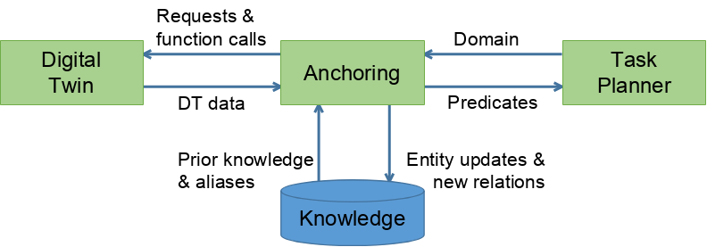
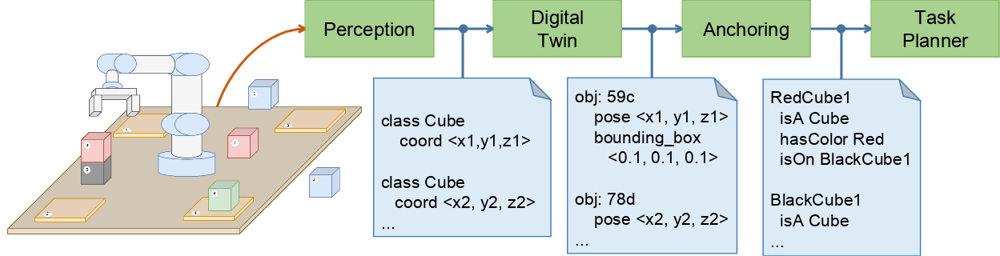

Generic Principles
==================

Semantic anchoring is the process in the robot situation awareness pipeline that integrates numerical data coming from perception with information in one (or more) digital twin(s), to produce a symbolic representation of current and predicted observations of operational environment.

A typical example of a semantic anchoring operation is the integration of estimated numerical poses of objects in the environment, provided by the perception algorithms and stored in a digital twin, with their bounding boxes information coming from geometric CAD data, to produce symbolic representation of facts (predicates), like whether one object is on top of another one. Other operations include the request of high-level computations to the digital twin to discover additional knowledge about the current situation, such as computing whether a given object can be grasped by a robot, based on the possibility that the gripper can be placed in a suitable object grasp pose, that the robot can reach the object grasp pose (via inverse kinematics computations) and finally based on whether an obstacle-free path exists between the current robot pose and the object grasp pose. These kind of high-level computations are expensive in terms of computing time and resources, and must be executed at opportune times to not jeopardize the system performance.

Semantic anchoring plays a crucial role, as it can infer a set of true/false symbols (predicates) that determine whether higher-level interactions with digital twins are needed and, if such is the case, which are the entities involved and the function-call parameters. Then, the anchoring module provides the inferred factual knowledge to the symbolic task planner, to permit the computation of a suitable action plan for the task goal at hand.

The inference mechanism at the core of semantic anchoring is enabled by a knowledge base constituted by an ontology and its rules, as shown in the figure below. The use of ontologies is key, as ontologies enable the access to a large body of knowledge representing standardized conceptualizations of multiple domains related to robot autonomy.

The next figure shows how the different processes in the situation awareness pipeline represent the knowledge available at their own level. The perception process can detect the class and position of the elements. The digital twin associates and maintains over time, an ID for the objects and stores their 3D models en properties. The anchoring process adds semantic meaning to the objects and allows to build predicates.

The anchoring process is made up of a number of logical blocks. These include an ontology manager, a digital twin integrator (that integrates informations coming from a digital twin into the ontology) and a generator of symbolic predicates for a task planner. SIT-AW-ANCHORING provides a ROS 2 based implementation of semantic anchoring's logical blocks in terms of managed (lifecycle) nodes, their topic/service/action interfaces and interactions.
