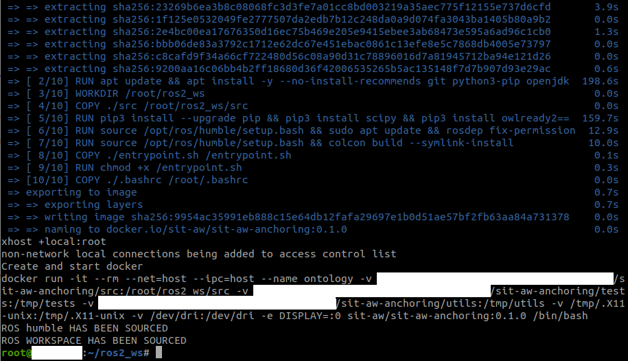

Build and run
=============

We provide a run-time environment based on docker which is extremely simple to build and gives immediate access to the SIT-AW-ANCHORING ROS 2 stack. Our docker environment is built on top of the `ROS Humble <https://docs.ros.org/en/humble/index.html>`_ base image.

How to build
------------

Assuming that `<path-to-sit-aw-anchoring>` is the path to the root folder of SIT-AW-ANCHORING on your filesystem, use the following command to build it:

.. code-block:: bash

    cd <path-to-sit-aw-anchoring>
    make start-docker

The docker build process may take a while. After the build ended, a `docker run` command is automatically executed and your console looks like this:

That's all! You are ready now to run the stack.

How to run
----------

We provide a `bringup` launch script to start and activate the lifecycle nodes that compose the SIT-AW-ANCHORING stack, namely `ontology_manager` and `digital_twin_integrator`. Nodes are configured with default options that you can change at run-time, using the `ros2 param` command-line tool.

Use this command to launch the bringup script:

.. code-block:: bash

    ros2 launch bringup activate_launch.py

Now open another terminal and "join" the docker to run commands that enable the interaction with SIT-AW-ANCHORING nodes. To join the docker, ensure that your working directory is set to `<path-to-sit-aw-anchoring>` and give the command

.. code-block:: bash

    make join-docker

You can now refer to `Tutorials`_ to see some concrete example of how to interact with SIT-AW-ANCHORING nodes.
