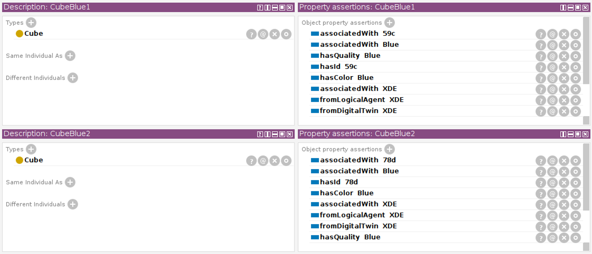
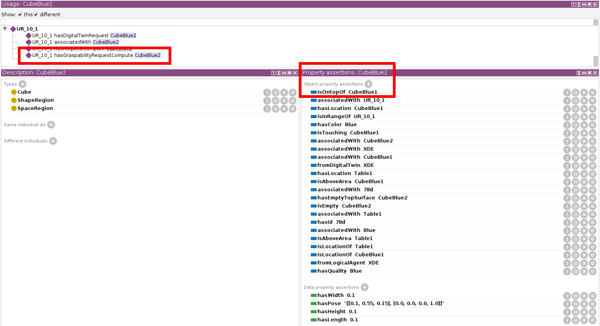

Tutorials
=========

.. note::

   The commands in these tutorials are given in a terminal connected to the SIT-AW-ANCHORING docker. Refer to `<installation>`_ for more details.

Detect an undesired situation in a blocks world domain
------------------------------------------------------

Semantic anchoring turns out to be a powerful mechanism to detect known anomalies, provided that the ontology and the associated reasoning rules at the core of the approach enable the conceptualization of undesired system states. These correspond to known undesired situations, that represent deviations faced by the robot with respect to nominal operational conditions and/or deviations with respect to the correct progress of tasks.

This tutorial shows how SIT-AW-ANCHORING can detect a known anomaly in a blocks world domain. We consider a virtual scene that contains two blue cubes and one Universal Robot robot.

The ontology and the rules that conceptualize the blocks world domain are in `tests/ontology/Anchology_design.rdf`. We consider that blocks (cubes) of the same color cannot be piled up one on top of the other, as an example of anomaly in our simple domain.

The scene description is in JSON format and we assume that the digital twin can export it (we consider one called XDE, a digital twin developed at CEA based on Unity3D). The JSON file that describes the virtual scene is `tests/setup_populator_0.json`.

.. code-block:: json

    [
      ...
      {
        "id": "Blue",
        "name": "blue",
        "setup_properties": {"class": "Color"}
      },
      {
        "id": "CubeBlue1",
        "name": "blue cube 1",
        "setup_properties": {"class": "Cube", "color": "Blue"},
        "DT_config": [{"DigitalTwin" : "XDE", "id_DT": "59c"}]
      },
      {
        "id": "CubeBlue2",
        "name": "blue cube 2",
        "setup_properties": {"class": "Cube", "color": "Blue"},
        "DT_config": [{"DigitalTwin" : "XDE", "id_DT": "78d"}]
      },
      {
        "id": "UR_10_1",
        "name": "Universal Robot UR_10",
        "setup_properties": {"class": "UniversalRobot", "range": "2"},
        "DT_config": [{"DigitalTwin" : "XDE", "id_DT": "j8p"}]
      },
      ...
    ]

In a first phase called *Setup*, we configure the `ontology_manager` to work with the blocks world domain and we request it to add individuals to the ontology.

.. code-block:: bash

    ros2 action send_goal /sitaw_cluster/ontology_manager/validate_set_ontology ontology_management_msgs/action/ValidateSetOntologyCS "{knowledge_domain: 'Design', ontology: '/tmp/tests/ontology/Anchology_design.rdf'}"

    ros2 action send_goal /sitaw_cluster/ontology_manager/populate_instances ontology_management_msgs/action/PopulateInstances "{knowledge_domain: 'Design', instances: '/tmp/tests/setup_populator_0.json'}"

Individuals represent instances of the ontology classes that correspond to elements in the virtual scene of the digital twin. Individuals have different unique identifiers in the digital twin and in the ontology: an alias attribute in the ontology instances allows to keep track of the different identifiers and ensures a consistent and coherent information in the digital twin and the ontology. The figure below shows the property assertions regarding the two blue cube individuals. We use `Protégé <https://protege.stanford.edu/>`_ to visualize the information in the ontology.

The second phase is called *Execution* and in this phase semantic anchoring receives requests at regular time intervals to produce a symbolic representation of operational environment for the task planner.

In the remaining part of this tutorial, we describe *one single work cycle*, as our focus is to show the detection of an anomaly that happens at a particular point in time during the robot operation.

The most recent information (in this example, at the instant where the anomaly occurs) is stored in the digital twin and comes from the perception pipeline. Again, this information is in JSON format and we assume that the digital twin can export it. The JSON file we consider in this tutorial is `tests/synthetic_DT_Data_0.json`.

.. code-block:: json

    [
      ...
      {
        "dt_id": "59c",
        "pose": "[[0.1, 0.55, 0.05], [0.0, 0.0, 0.0, 1.0]]",
        "bounding_box_height": "0.1",
        "bounding_box_width": "0.1",
        "bounding_box_length": "0.1"
      },
      {
        "dt_id": "78d",
        "pose": "[[0.1, 0.55, 0.15], [0.0, 0.0, 0.0, 1.0]]",
        "bounding_box_height": "0.1",
        "bounding_box_width": "0.1",
        "bounding_box_length": "0.1"
      },
      ...
    ]

The numerical values of cubes' poses and bounding boxes shows that, at the considered instant, `CubeBlue2` (identifier `78d` in the digital twin) is piled up on `CubeBlue1` (id `59c` in the digital twin).

We request the `digital_twin_integrator` node to accesses this information with the following command:

.. code-block:: bash

    ros2 action send_goal /sitaw_cluster/digital_twin_integrator/update_state digital_twin_integrator_msgs/action/DigitalTwinIntegratorUpdateState "{knowledge_domain: 'Design'}"

The execution of this action causes a series of interactions between the `digital_twin_integrator` and the `ontology_manager` that are transparent to the user. The properties of ontology individuals are updated and inference rules are applied. Figure below shows how the application of inference rules (reasoning) modifies the property assertions of `CubeBlue2`.

Finally, as cubes can be moved around in the scene, the inference process generates a `hasGraspabilityRequestCompute` assertion that relates `UR_10_1` on `CubeBlue2`. This prompts further interaction between the `digital_twin_integrator` node and the digital twin (not covered in this tutorial though) aiming to derive new knowledge and test whether `UR_10_1` can grasp `CubeBlue2`, which improves the system awareness regarding the current situation.
