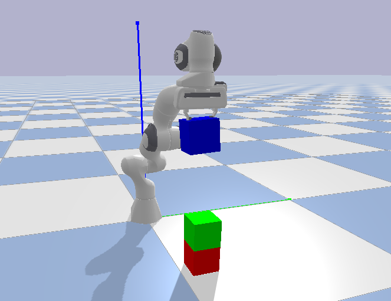
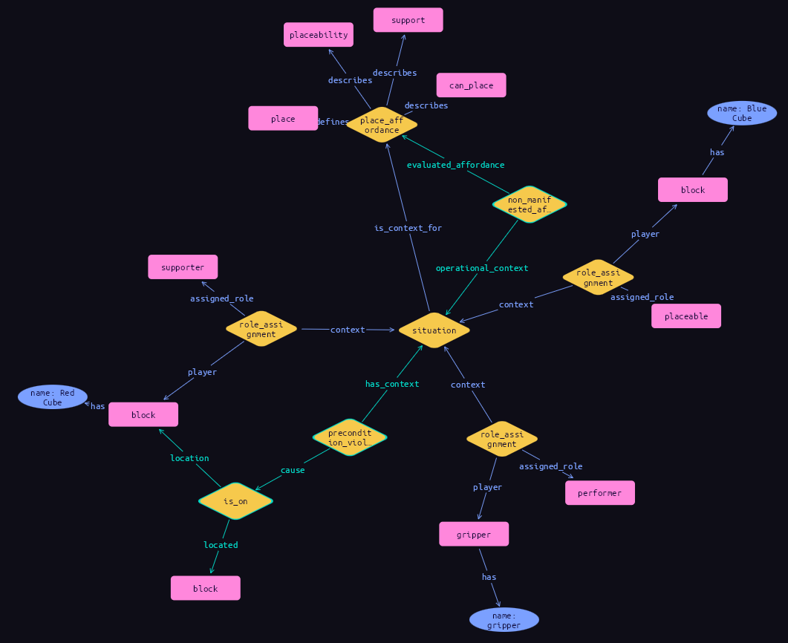

Tutorials
=========

.. note::

   The commands in these tutorials are given in a terminal connected to the SIT-AW-ANCHORING docker. Refer to `<installation>`_ for more details.

Detect an undesired situation in a blocks world domain
------------------------------------------------------

Semantic anchoring turns out to be a powerful mechanism to detect known anomalies, provided that the ontology and the associated reasoning rules at the core of the approach enable the conceptualization of undesired system states. These correspond to known undesired situations, that represent deviations faced by the robot with respect to nominal operational conditions and/or deviations with respect to the correct progress of tasks.

This tutorial shows how SIT-AW-ANCHORING can detect a known anomaly in a blocks world domain. We consider a virtual scene with one robot and three colored cubes: blue, green, and red. The robot is tasked with placing the blue cube on the red one, but the green cube is already positioned on the red cube, preventing the robot from completing its task without first adjusting the scene. This situation serves as an example of an anomaly in our simple domain.

The scene description is provided in JSON format, assuming that the digital twins the anchoring process interacts with can export it.

The description specifies the mapping between entities in the digital twins and concepts in the SKRAWL ontology. These include geometric entities such as blocks:

.. code-block:: json

    ...
    {
      "id": "RedCube",
      "name": "Red Cube",
      "setup_properties": {
        "class": "block"
      },
      "DT_config": [
        {
          "DigitalTwin": "pybullet",
          "id_DT": "C"
        }
      ]
    },
    ...

Robot parts:

.. code-block:: json

    ...
    {
      "id": "Gripper",
      "name": "gripper",
      "setup_properties": {
        "class": "gripper"
      },
      "DT_config": [
        {
          "DigitalTwin": "pybullet",
          "id_DT": "gripper"
        }
      ]
    },
    ...

And functional entities, such as instances of actions that the robot must perform:

.. code-block:: json

    ...
    {
      "id": "_place44",
      "name": "place 44",
      "setup_properties": {
        "class": "place"
      },
      "DT_config": [
        {
          "DigitalTwin": "btcpp",
          "id_DT": "place44"
        }
      ]
    },
    ...

Geometric entities are sourced from physics simulators, such as `PyBullet <https://pybullet.org/>`_, while functional entities come from, e.g., behavior execution libraries like `BehaviorTree.CPP <https://www.behaviortree.dev/>`_.

Note that not all digital twin entities need to be mapped into SKRAWL concepts. For example, in this case, we consider only the robot gripper rather than all the robot's links and joints.

The full JSON file that describes the virtual scene is located at `/tmp/dt/setup.json`.

We launch the digital twins using the following command:

.. code-block:: bash

    ros2 launch pybullet_dt pybullet_dt.launch.py simulation_script:=/tmp/dt/DT_Simulation.py

The anchoring process, is launched with this command:

.. code-block:: bash

    ros2 launch pick_place_uc pick_place_uc_launch.py

In a first phase called *Setup*, the anchoring manager is configured to work with the blocks world domain and we request it to add individuals to the ontology.

Individuals represent instances of the ontology classes that correspond to elements in the virtual scene of the digital twins. Individuals have different unique identifiers in the digital twins and in the ontology: an alias attribute in the ontology instances allows to keep track of the different identifiers and ensures a consistent and coherent information in the digital twin and the ontology. 

The second phase is called *Execution* and in this phase semantic anchoring receives requests at regular time intervals to produce a symbolic representation of operational environment for the task planner.

In the remaining part of this tutorial, we describe *one single work cycle*, as our focus is to show the detection of an anomaly that happens at a particular point in time during the robot operation.

The most recent information (in this example, at the instant where the anomaly is detected) is stored in the digital twins. Geometric information comes from the perception pipeline. Functional information is sourced from the behavior executor. This information is supplied by the digital twins to the anchoring process in JSON format upon execution of the following command:

.. code-block:: bash

    ros2 action send_goal /anchoring_process/update_state anchoring_process_interfaces/action/UpdateState "{knowledge_domain: 'SkrawlMoMa'}"

The execution of this action causes a series of interactions between the `anchoring_process` and the digital twins that are transparent to the user. The properties of ontology individuals are updated and inference rules are applied. The figure below illustrates how the application of inference rules (reasoning) deduces the cause of the non-manifestation of the place affordance for the robot's place task. All the inferred knowledge is outlined in green.

`situation` is the central concept that represents the task execution. It serves as the context for a `place_affordance`, which defines a `place` task involving three participants: the `performer` of the action -- the `gripper`, which possesses the `can_place` capability; the `placeable` entity -- the `Blue Cube` held by the `gripper`, which has the `placeability` disposition; and the `supporter` -- the `Red Cube`, which has the `support` disposition (the target where the `Blue Block` is to be placed).

The `situation` acts as the `operational_context` for the non-manifested place affordance. The `cause` of the non-manifestation is the presence of the `is_on` relation, indicating that another block not involved in the task execution --`Green Cube`-- is `located` on the `Red Cube`.

The snapshot of the robot's internal knowledge in the above figure is obtained with the following query in TypeDB Studio:

.. code-block:: bash

    match
      $nmpa (evaluated_affordance: $pa, operational_context: $sit) isa non_manifested_affordance;
      $pa (describes: $cwo, describes: $dwt, describes: $dwr) isa place_affordance;
      (has_context: $sit, cause: $cause) isa precondition_violation;
      (assigned_role: $ar, player: $p, context: $s) isa role_assignment;
      $p isa physical_entity, has name $pn;
    get;

